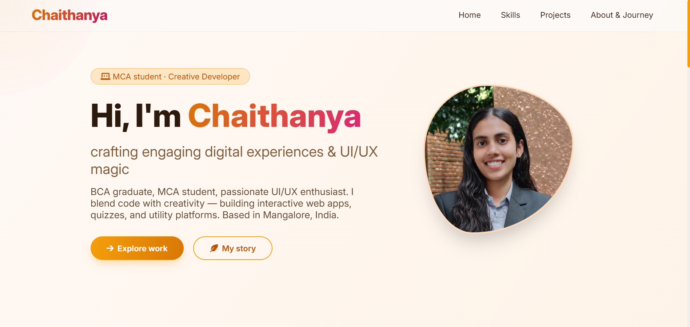

# PRODIGY_WD_04 - Personal Portfolio Website

[](https://chaithanya8861.github.io/PRODIGY_WD_04/)
[](https://github.com/Chaithanya8861)
[](https://www.linkedin.com/in/chaithanya-094a71322)
[](https://youtube.com/@chaithanya_shettigar)

---

## 📸 Screenshots

### Desktop View - Hero Section


### Skills Section


### Projects Section


### About Me & Timeline


### Mobile Responsive View


---

## 🌐 Live Demo

**Visit my portfolio website:** [https://chaithanya8861.github.io/PRODIGY_WD_04/](https://chaithanya8861.github.io/PRODIGY_WD_04/)

---

## 📋 Project Overview

This is my personal portfolio website created as part of my **Prodigy Infotech Internship - Task 04**. It showcases my skills, projects, achievements, and professional journey as a creative web developer.

### 🎯 Task Requirements Completed

- ✅ Build a personal portfolio website
- ✅ Showcase skills, projects, and accomplishments
- ✅ Attractive and visually appealing layout
- ✅ Home page with captivating headline, professional photo, and skills summary
- ✅ "About Me" section with detailed background, education, and professional experience

---

## ✨ Features

| Feature | Description |
|---------|-------------|
| 🎨 **Modern Design** | Clean, creative layout with warm orange theme |
| 📱 **Fully Responsive** | Works perfectly on desktop, tablet, and mobile |
| ✨ **Smooth Animations** | Scroll-triggered animations using AOS library |
| 🖱️ **Custom Cursor Glow** | Interactive cursor effect for modern feel |
| 🚀 **Project Showcase** | Live links to all deployed projects |
| 📅 **Professional Timeline** | Education, experience, and achievements |
| 🔗 **Social Integration** | Links to GitHub, LinkedIn, and YouTube |
| 🪟 **Glassmorphism UI** | Modern translucent navigation and cards |

---

## 🛠️ Technologies Used

| Category | Technologies |
|----------|--------------|
| **Frontend** | HTML5, CSS3, JavaScript ES6 |
| **Animations** | AOS (Animate on Scroll), Custom CSS Keyframes |
| **Icons** | Font Awesome 6 |
| **Fonts** | Google Fonts (Inter) |
| **Deployment** | GitHub Pages |

---

## 📁 Project Structure

PRODIGY_WD_04/
│
├── index.html # Main HTML file
├── README.md # Project documentation
│
└── image/ # Images folder
└── Profile.jpeg # Profile photo


---

## 🚀 Featured Projects

| # | Project | Live Demo | Tech Stack |
|---|---------|-----------|-------------|
| 1 | **QuizMaster App** | [Live Demo](https://quizmaster-801c1.web.app/) | JavaScript, Firebase |
| 2 | **Water Tanker Delivery** | [Live Demo](https://techwatertanker.netlify.app/) | React, Netlify |
| 3 | **Portfolio Website** | [Live Demo](https://chaithanya8861.github.io/PRODIGY_WD_04/) | HTML, CSS, JS |
| 4 | **Stopwatch App** | [Live Demo](https://chaithanya8861.github.io/PRODIGY_WD_02/) | HTML, CSS, JS |

---

## 👩‍💻 About Me

- **Name:** Chaithanya
- **Education:** MCA Student at St Aloysius (Deemed To be University) | BCA Graduate from Vivekananda College Puttur
- **Location:** Mangalore, India
- **Role:** Creative Developer & UI/UX Enthusiast
- **Email:** chaithanya8861@gmail.com

### 🏆 Achievements
- Hackathon at Akanksha Charitable Trust
- YouTube Artist (Chaithu's Art Gallery)
- Ranger - Bharat Scouts & Guides (Social Service)

---

## 🔧 Installation & Local Development

### Prerequisites
- Any modern web browser
- Code editor (VS Code recommended)

### Steps to Run Locally

1. **Clone the repository**
```bash
git clone https://github.com/Chaithanya8861/PRODIGY_WD_04.git
cd PRODIGY_WD_04
